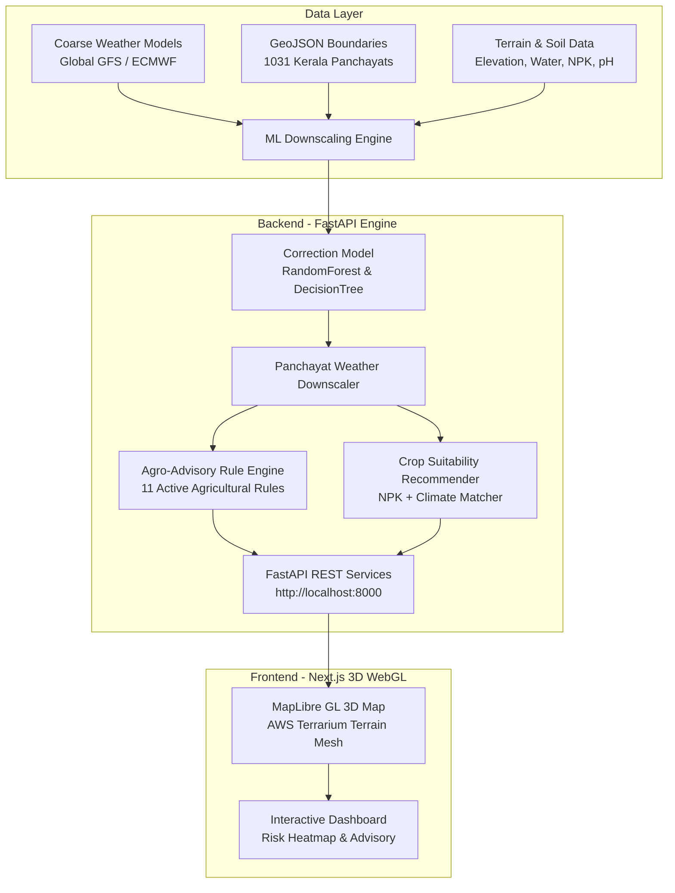

# 🌱 Conclave-TeamKore: Village-Level Weather Downscaling & Agro-Advisory Platform

A hyper-local machine learning weather downscaling platform and 3D geospatial agro-advisory engine built for **1,031 Panchayats and Municipalities across Kerala, India**.

Developed for **AI Conclave Hackathon** by **Team Kore**.

---

## 📌 Executive Summary

Global numerical weather prediction (NWP) models typically operate at coarse grid resolutions ($10 \text{ km} \times 10 \text{ km}$ or higher). In regions with complex topography like Kerala—spanning coastal plains, midland hills, and high-altitude Western Ghats mountain ranges—coarse forecasts miss crucial microclimatic variations.

**Conclave-TeamKore** bridges this gap by combining:
1. **Machine Learning Weather Downscaling**: ML ensemble models trained on elevation, water proximity, land-use cover, and microclimate deltas to predict high-resolution village-level weather parameters (temperature, rainfall, humidity, and wind speed).
2. **Agro-Advisory Engine**: Rule-based recommendation system that evaluates downscaled weather conditions against crop stages to trigger actionable advisories (e.g., frost alerts, spraying windows, irrigation timing, heat stress warnings).
3. **Crop Suitability & Recommendation System**: ML algorithms evaluating soil parameters (NPK, pH, electrical conductivity) and microclimate to recommend optimal crops per Panchayat.
4. **Interactive 3D Geospatial Map**: Next.js WebGL application featuring real-time 3D terrain mesh displacement, terraced parcel extrusions, heatmaps, and Panchayat risk indicators following Apple-inspired continuous squircle UI design principles.

---

## 🏗️ System Architecture



---

## ✨ Key Features

- 🛰️ **Micro-Local Weather Downscaling**: Predicts village-level weather parameters corrected for local elevation, terrain slope, proximity to water bodies, and land cover types.
- 🗺️ **3D Terrain & GPU Mesh Visualization**: Renders real 3D terrain elevation displacement using Mapzen Terrarium DEM tiles, customizable basemaps (Satellite, OSM, Carto Voyager), and pitch angles up to 85°.
- 🌾 **Automated Agro-Advisory Engine**: Generates real-time localized warnings (Frost Alert, Heat Stress, Heavy Rain Warning, Optimal Spraying Window, Drainage Advisory).
- 🧪 **Crop Suitability Engine**: Ranks suitable crops based on live downscaled weather and soil chemistry (Nitrogen, Phosphorus, Potassium, pH, EC).
- 👥 **Dual-Profile Dashboard**:
- **Interactive Map View**: Statewide Kerala overview, risk heatmaps, Panchayat risk-level polygons, and multi-village comparison. Targeted village view, field stats (NDVI, soil moisture, acreage), and direct advisory summaries.
- 🔍 **Unified Micro-Search**: Instant search across Panchayats, districts, and crop varieties with pill animation and drop-down suggestions.

---

## 💻 Tech Stack

| Layer | Technologies |
| :--- | :--- |
| **Frontend Framework** | [Next.js 16](https://nextjs.org/) (App Router + Turbopack), [React 19](https://react.dev/), TypeScript |
| **3D Map & WebGL** | [MapLibre GL JS](https://maplibre.org/), `react-map-gl`, AWS Mapzen Terrarium Elevation Tiles |
| **Styling & UI** | Tailwind CSS, Phosphor Icons (`@phosphor-icons/react`), Apple-style Continuous Squircle System |
| **Backend API** | [FastAPI](https://fastapi.tiangolo.com/), Uvicorn ASGI Server, Pydantic v2 |
| **Machine Learning** | `scikit-learn` (`RandomForestRegressor`, `DecisionTreeRegressor`, `StandardScaler`), `pandas`, `numpy` |
| **Geospatial Processing**| `geopandas`, `shapely`, GeoJSON |

---

## 📂 Repository Structure

```
Conclave-TeamKore/
├── backend/                        # FastAPI Backend Service
│   ├── app/
│   │   ├── api/                    # API Route Handlers (routes.py, crop_routes.py)
│   │   ├── services/               # Core Business Logic
│   │   │   ├── forecast_service.py # Weather Downscaling Logic
│   │   │   ├── advisory_service.py # Agro-Advisory Engine Rules
│   │   │   ├── crop_recommendation_service.py # Crop Suitability Rules
│   │   │   ├── spatial_service.py  # Spatial GeoJSON Indexer
│   │   │   └── data_service.py     # Data Loader & Repository
│   │   ├── config.py               # Application Settings
│   │   └── main.py                 # FastAPI Application Entrypoint
│   ├── artifacts/                  # Trained ML Models (.pkl) & Rules (.json)
│   ├── scripts/                    # Model Training Scripts (train_and_export_ml.py)
│   ├── requirements.txt            # Python Dependencies
│   └── start.sh                    # Turnkey Backend Startup Script
├── frontend/                       # Next.js 16 Web Application
│   ├── app/
│   │   ├── api/terrain/[...slug]/   # High-Speed In-Memory Elevation Tile Proxy
│   │   ├── globals.css             # Custom Design Token System & Map Overrides
│   │   ├── layout.tsx              # Root Layout
│   │   └── page.tsx                # Main Dashboard View
│   ├── components/
│   │   ├── Map3D.tsx               # Main WebGL 3D Map Component & Controls
│   │   └── Map3DWrapper.tsx        # SSR-Safe Dynamic Wrapper Component
│   ├── data/                       # Crop Parcel Datasets
│   ├── public/                     # MapLibre Web Workers & Static Assets
│   └── package.json                # Node.js Dependencies & Build Scripts
├── data/                           # Spatial Data (kerala_panchayats.geojson)
├── mldev1/                         # ML Exploration Workspace (Phase 1)
├── mldev2/                         # Refined ML Workspace, Artifacts & Contracts
├── DESIGN.md                       # UI/UX & Design Guidelines
├── Map3dREADME.md                  # Map Component Developer Guide
└── README.md                       # Project Documentation (This File)
```

---

## 🚀 Getting Started

### Prerequisites

- **Python**: 3.10 or higher
- **Node.js**: 18.18 or higher (with `npm`)

---

### Quick Start (Turnkey Launch)

#### 1. Start the Backend API Server
```bash
cd backend
bash start.sh
```
*The script automatically verifies/trains ML artifacts and starts Uvicorn on `http://localhost:8000`.*

- **API Documentation (Swagger UI)**: [http://localhost:8000/docs](http://localhost:8000/docs)
- **ReDoc UI**: [http://localhost:8000/redoc](http://localhost:8000/redoc)

#### 2. Start the Frontend Application (in a new terminal)
```bash
cd frontend
npm install
npm run dev
```
*Access the web application at [http://localhost:3000](http://localhost:3000).*

---

## 🔌 API Endpoints Summary

| Endpoint | Method | Description |
| :--- | :---: | :--- |
| `GET /villages` | `GET` | Returns Kerala Panchayats/Municipalities (GeoJSON format supported). |
| `GET /forecast/{panchayat_id}` | `GET` | Returns downscaled 7-day weather forecast for a specific Panchayat. |
| `GET /advisory/{panchayat_id}` | `GET` | Evaluates current forecast and returns active agricultural advisories. |
| `GET /recommend-crop/{panchayat_id}` | `GET` | Ranks suitable crops based on microclimate & soil chemistry. |
| `GET /api/terrain/{z}/{x}/{y}.png` | `GET` | High-speed cached proxy for 3D elevation terrain mesh tiles. |

---

## 🧠 Machine Learning & Advisory Engine

### Weather Downscaling Model
The downscaling model corrects coarse regional forecasts ($\mathbf{x}_{\text{coarse}}$) using high-resolution static features:
$$\Delta y = f(\text{Elevation}, \text{Distance to Water}, \text{Land Cover}, \text{Coarse Temp}, \text{Coarse Rain}, \text{Coarse Humidity})$$
$$\text{Temperature}_{\text{village}} = \text{Temperature}_{\text{coarse}} + \Delta y$$

### Advisory Rules Matrix
Evaluating 11 active rule triggers including:
- ❄️ **Frost Alert**: Triggered when downscaled temperature drops below $4^\circ\text{C}$ in highland zones (e.g., Idukki).
- 🔥 **Heatwave Warning**: Triggered when max temperatures exceed $37^\circ\text{C}$ for 2+ consecutive days.
- 🌧️ **Heavy Rain Warning**: Triggered when predicted 24-hour rainfall exceeds $64.5\text{ mm}$.
- 🧴 **Spraying Window**: Identified when rainfall $< 1\text{ mm}$, wind speed $< 15\text{ km/h}$, and humidity $< 85\%$.

---

## 🎨 Design System & Aesthetic Principles

The frontend strictly adheres to modern aesthetic guidelines specified in [`DESIGN.md`](DESIGN.md):
- **Apple Continuous Squircles**: Containers utilize `corner-shape: squircle` with generous curvature (`border-radius: 4rem`).
- **No Glow / No Shadows**: Clean 1px light slate borders (`#e2e8f0`) instead of heavy shadows or luminous halos.
- **Light Surfaces**: Clean white (`#ffffff`) and slate background chrome to maximize readability.
- **Phosphor Iconography**: Exclusively uses `@phosphor-icons/react` vector icons.

---

## 📜 License

This project is open-source software licensed under the **ISC License**.
